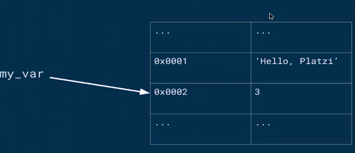

# Introduccion-al-pensamiento-computacional-con-python


**Contenido**

[Clase 3 Introducción al computo](#Clase-3-Introducción-al-computo])

[Computo y computadoras](#Computo-y-computadoras)

[Clase 4 Introducción a los lenguajes de programación](#Clase-4-Introducción-a-los-lenguajes-de-programación)

[¿Como dar instrucciones?](#¿Como-dar-instrucciones?)

[Lenguajes de programación](#Lenguajes-de-programación)

[Todos los lenguajes tienen:](#Todos-los-lenguajes-tienen:)

[Clase 5 Preparación de tu computadora](#Clase-5-Preparación-de-tu-computadora)

[Visual Studio Code](#Visual-Studio-Code)

[Clase 6 Elementos basicos de python](#Clase-6-Elementos-basicos-de-python)

[• Bajo Nivel vs Alto Nivel](#•-Bajo-Nivel-vs-Alto-Nivel)

[• General vs Dominio especifico](#•-General-vs-Dominio-especifico)

[• Interpretado vs Compilado](#•-Interpretado-vs-Compilado)

[Elementos basico de Python](#Elementos-basico-de-Python)

[Objetos, expresiones y tipos numericos](#Objetos,-expresiones-y-tipos-numericos)

[Clase 7 Asignación de variables](#Clase-7-Asignación-de-variables)

[Clase 8 cadenas y entradas](#Clase-8-cadenas-y-entradas)

[Entradas (inputs)](#Entradas-(inputs))

[Clase 9 Programas ramificados](#Clase-9-Programas-ramificados)

[Clase 10 iteraciones o Loops](#Clase-10-iteraciones-o-Loops)

[Clase 11 Bucles for](#Clase-11-Bucles-for)

[El bucle for en Python](#El-bucle-for-en-Python)

[Iterables](#Iterables)

[¿Cómo implementa Python los bucles definidos?](#¿Cómo-implementa-Python-los-bucles-definidos?)

[Iterators](#Iterators)

[Bucles for con diccionarios](#Bucles-for-con-diccionarios)

[Modificación del comportamiento de un bucle for](#Modificación-del-comportamiento-de-un-bucle-for)

[Conclusiones](#Conclusiones)

[Clase 12 Representación de flotantes](#Clase-12-Representación-de-flotantes)

[Clase 13 Enumeración exhaustiva](#Clase-13-Enumeración-exhaustiva)

[Clase 14 Aproximación de soluciones](#Clase-14-Aproximación-de-soluciones)

[Clase 15 Búsqueda binaria](#Clase-15-Búsqueda-binaria)

[Clase 16 Funciones y alcance de las funciones](#Clase-16-Funciones-y-alcance-de-las-funciones)

[Abstracción](#Abstracción)

[Decomposicion](#Decomposicion)

[Definición de funciones](#Definición-de-funciones)

[Clase 17 Scope o alcance](#Clase-17-Scope-o-alcance)

[Alcance](#Alcance)

[Clase 18 Especificaciones del código](#Clase-18-Especificaciones-del-código)

[Clase 19 Recursividad](#Clase-19-Recursividad)

[Clase 20 Fibonnacci y la Recursividad](#Clase-20-Fibonnacci-y-la-Recursividad)

[Clase 21 Funciones como objetos](#Clase-21-Funciones-como-objetos)

[Funciones como objetos](#Funciones-como-objetos)

[Argumentos de otras funciones](#Argumentos-de-otras-funciones)

[Funciones en expresiones](#Funciones-en-expresiones)

[Funciones en estructuras de datos](#Funciones-en-estructuras-de-datos)

[Clase 22 Tuplas](#Clase-22-Tuplas)

[Tuplas](#Tuplas)

[Clase 23 Rangos](#Clase-23-Rangos)

[Clase 24 Listas y mutabilidad](#Clase-24-Listas-y-mutabilidad)

[Clonacion](#Clonacion)

[List comprehension](#List-comprehension)

[Clase 25 Diccionarios](#Clase-25-Diccionarios)

[Clase 26 Pruebas de caja negra](#Clase-26-Pruebas-de-caja-negra)

[Clase 27 Pruebas de caja de cristal](#Clase-27-Pruebas-de-caja-de-cristal)

[Clase 28 Debugging](#Clase-28-Debugging)

[Diseño de experimentos](#Diseño-de-experimentos)

[Errores comunes](#Errores-comunes)

[Clase 29 manejo de excepciones](#Clase-29-manejo-de-excepciones)

[Clase 30 Excepciones y control de flujo](#Clase-30-Excepciones-y-control-de-flujo)

[Excepciones como control de flujo](#Excepciones-como-control-de-flujo)

[Clase 31 Afirmaciones](#Clase-31-Afirmaciones)


## Clase 3 Introducción al computo

“Primera computadora” creada por los griegos, calcula la posición del sol, luna y algunas constelaciones.


    1. En 1801, Telar de Jacquar, separa el resultado de la informacion que contiene las instrucciones para poder realizar muchos tipos de telas.Siglo XIX, Motor analítico de Babbage, haciendo uso del avances en mecánica (engranajes) de su época logra separar instrucciones de calculo y realizar varios cálculos a la vez.
    

   

    2. Finales siglo XIX, ENIAC (Electronic Numerical Integrator and Computer) usaba sistema decimal. creada por Alan Turing y Alonso Church. Esta época exigía exactitud en los cálculos que hacían que compañías dependieran de esta(Compañías Ferroviarias por ejemplo). Turing y Alonso, Descubrieron que matemáticamente todos los algoritmos podíamos reducirlos a una secuencia de soluciones matemáticas.


    3. En 1945, Arquitectura de Von Neumann, EDVAC (Electronic Discrete Variable Automatic Computer) usaba sistema binario. Su aporte fue el descubrimiento que dentro de los componentes electrónicos se puede usar una serie de hardware para realizar el computo y almacenar datos dentro de memoria y genera la primera computadora a la cual se le puede introducir un programa.
    


       
    4. En 1950, Microchip, ejemplo Apple 1
    

  


    5. En siglo XX, Arquitectura de Richard Feymann, aporta las bases matemáticas de computo cuántico.


  


### Computo y computadoras

    • Las computadoras hacer dos cosas: hacen  cálculos y recuerdan el resultado de dichos cálculos
    • Por la mayoría de la historia humana, estábamos limitados por la velocidad del cerebro y la mano
    • Aun con las computadoras modernas existen problemas que no podemos resolver
    
## Clase 4 Introducción a los lenguajes de programación

### ¿Como dar instrucciones?

Existe:
    • Conocimiento declarativo → Nos dice que tipo de relaciones existen entre diversas variables u objetos como una formula matemática
    • Conocimiento imperativo → Nos dice como llegar a un resultado por ejemplo a través de los algoritmos
        ◦ Que es un algoritmo → Un algoritmo es una lista finita de instrucciones que describen un computo, que cuando se ejecuta con ciertas entradas(inputs) ejecuta pasos intermedios para llegar a un resultado(output). 

### Lenguajes de programación


Podemos escribir programación de tal forma que lo entendamos los humanos y podemos traducir instrucciones de computo en 1 y 0 que las computadoras pueden entender.

El lenguaje C es uno de lo mas importantes de la historia, gracias a que su sintaxis fue tan comprensible desde el momento en el que nació es que hoy en día existen diversos lenguajes de programación, se podría decir que C es uno de los padres de los lenguajes de programación que hoy en día existen

Guido Van Rossum se dio cuenta que una cosa de los lenguajes de programación era que fueran comprensibles como python, este personaje lo que hizo fue eliminar todos los símbolos que hacían tener problemas cognitivos y utilizar el lenguaje que entendemos como seres humanos

### Todos los lenguajes tienen:

    • Sintaxis → Define la secuencia de símbolos que esta bien formada
    • Semántica estática → Define que enunciados con sintaxis correcta tienen significado
    • Semántica → Define el significado. En los lenguajes de programación solo hay un significado 

## Clase 5 Preparación de tu computadora

Antes de comenzar este curso asegúrate de preparar tu entorno de trabajo para poder hacer todos los ejercicios. A continuación te compartiré los pasos que debes seguir para configurar tu computadora.
Si estás usando Windows asegúrate de instalar lo siguiente en tu computadora:
Python 3.7 (o superior)
1. Para obtener el instalador dirígete a https://www.python.org/downloads/


2. Descarga el instalador y ejecútalo en tu computadora.


3. Habilita la casilla de verificación en Install launcher for all users y Add Python 3.8 to PATH. A continuación presiona en Install Now. Windows te solicitará permisos para instalar Python en tu computadora.


4. Al finalizar la instalación se abrirá una ventana como la siguiente, en ella deberás presionar en la opción Disable path length limit. Windows te solicitará permisos para realizar este cambio.


### Visual Studio Code
En el curso el profesor utiliza Visual Studio Code, un editor de textos que tiene integradas varias herramientas que te ayudarán a desarrollar tus ejercicios con facilidad. Para obtenerlo en tu computadora, dirígete a: https://code.visualstudio.com/


1. Realiza una instalación normal de Visual Studio code.


Una vez instalado se ejecutará Visual Studio Code.
2. En Visual Studio Code dirígete al panel de Extensiones, se encuentra en el panel lateral izquierdo. Ahí deberás buscar la extensión llamada Python.


3. Selecciona la extensión creada por Microsoft, la identificarás por ser similar a la que se muestra en la imágen. Una vez seleccionada, instálala


4. Una vez instalada, reinicia Visual Studio Code.
Listo con esto podrás correr los programas que escribas en python en la terminal de Visual Studio Code.
Cuando quieras correr tu programa en la terminal de Visual Studio Code, puedes introducir la dirección como lo muestra el profesor en el curso o presionar en el botón “Run Python File in Terminal”


## Clase 6 Elementos basicos de python
Lenguajes de programación
     • Bajo Nivel vs Alto Nivel
        ◦ Alto nivel significa que esta diseñado para los humanos que se acerca mas al nivel al que utilizamos los seres humanos que al lenguaje de las maquinas
        ◦ Bajo nivel significa que esta optimizado para que una maquina pueda entenderlo se parece mas a los 1 y 0
     • General vs Dominio especifico
        ◦ Los generales significa que tiene todos los primitivos que otorga touring que necesitabamos para poder implementar y computar cualquier tipo de algoritmo
        ◦ Dominio especifico son lenguajes especializados que estan targueteados a aplicaciones muy especificas
     • Interpretado vs Compilado
        ◦ Los lenguajes interpŕetados significa que mientras corre el programa despues de cada instrucción se traduce al lenguaje maquina
        ◦ El lenguaje compilado significa que nosotros convertimos antes de entregarselo a la computadora en un lenguaje maquina 
Python es un lenguaje de alto nivel en general en el que se puede implementar cualquier tipo de algoritmo posible y a su vez este lenguaje traduce a la maquina 

### Elementos basico de Python


### Objetos, expresiones y tipos numericos
Objetos
Son la abstraccion mas alta dentro de cualquier lenguaje de programacion, son la forma en la que modelamos el mundo dentro de la computadora, los objetos son valores en memoria que podemos  referenciar con algun tipo de variable
Tipos
    • Enteros
    • Flotantes o Decimales
    •  Booleanos
    • vector
    • objetos mas complejos

Los tipos se pueden dividir entre escalares y no escalares


    • Significa que podemos subdividir o no pequeñas piezas como el lego 

    


## Clase 7 Asignación de variables
Las variables son nombres que se vinculan con un valor en memoria y se hace a través del operador de asignación que es “=”


La anterior seria una forma basica para realizar una operación, pero es importante tener en cuenta que debe tener un sentido como el siguiente


Las variables deben tener nombre que signifique algo para los humanos 
Es posible reasignar variables en cualquier lenguaje de programación


Esta es una representación de como se vería en memoria en el anterior slide 



Reglas de las variables
    • Pueden contener mayúsculas, minúsculas, números(sin comenzar con uno) y el símbolo _
    • No pueden llamarse como las palabras reservadas del lenguaje 


    • hacen los programas mas comprensibles
    • son simplemente nombres que apuntan a un valor en memoria
    • El operador de asignacion (=) asocia una variable con un valor


## Clase 8 cadenas y entradas
Las cadenas son secuencias de caracteres 
Ejemplos de estos en la consola con python3


Se pueden aplicar diferentes funciones a las cadenas (Strings)
    • len (longitud) → Nos da la longitud de la cadena
    • indexing (indexacion) → para acceder a cada uno de los elementos  de la cadena a traves de indices 
    • slicing (rebanadas) → Se puede dividir una cadena en rebanadas para poder obtener sub cadenas o sub strings que se puede manipular con posterioridad
    • my_str[comienzo:fin:pasos]


    • Los objetos de tipo str pueden representarse con “ ” o ‘ ’
    • El operador + tiene diferente significado según el tipo de dato (overloaded). Con cadenas significa concatenacion
    • El operador * es el operador de repeticion con cadenas
    • Las cadenas son inmutables significa que una vez que se declara en memoria ya no se puede modificar
### Entradas (inputs)
    • Python tiene la función input para recibir datos del usuario del programa
    • input siempre regresa cadenas, por lo que si queremos utilizar otro tipo, tenemos que hacer type casting


A continuación se utiliza casting


## Clase 9 Programas ramificados
operadores de comparación y lógicos que sirven para determinar el resultado de una operación, estos operadores ayudan a tomar decisiones que pueden estar en una condición 


la Indentancion es el espaciado y la forma en que se indenta después de una función o condición es con 4 espacios


## Clase 10 iteraciones o Loops
    • La mayoría de las tareas computacionales no se pueden lograr con ramificaciones
    • Cuando queremos que un programa haga lo mismo varias veces, utilizamos iteraciones
    • Se pueden escribir iteraciones dentro de iteraciones
    • Podemos utilizar break para salir anticipadamente de una iteración
    • Tener cuidado de iteraciones infinitas porque entonces el programa no se puede detener aunque en python se puede utilizar Ctrl + C para matar un proceso y en general tambien se puede realizar esto en la terminal


## Clase 11 Bucles for
Los bucles, en diversos lenguajes de programación pueden ser definidos o indefinidos. Los bucles definidos preestablecen las condiciones de la iteración por adelantado. Por su parte, los bucles indefinidos establecen la condición en la que una iteración terminará. En este último tipo de bucles existe el riesgo de que el bucle se vuelva infinito (cuando la condición de suspensión nunca se cumple).

Los bucles definidos se implementan en Python a través del keyword for. Por su parte, los bucles indefinidos se implementan con el keyword while.


Sin embargo, esta no es la única forma de implementar bucles definidos. Por ejemplo, Javascript puede implementar un bucle definido mediante el siguiente constructo:

```
for (i = 0; i <= 10; i++) {
  <expresión>
}
```

El bucle se puede leer de la siguiente manera:


    • Inicializa el bucle en 0

    • Continua el bucle mientras i sea menor o igual que 10

    • Incrementa i en uno al final de cada iteración

Es importante señalar que la expresión i++ es equivalente a lo que en Python escribiríamos como i += 1.

Una segunda forma de crear un bucle definido es iterando en una colección de objetos. Esta es la forma que Python utiliza:

```
for <variable> in <iterable>:
    <expresión>
```

### El bucle for en Python
En la definición anterior debemos entender <iterable> como una colección de objetos; y la <variable> como el elemento específico que se está exponiendo mediante el bucle en cada iteración.

```
>>> frutas = ['manzana', 'pera', 'mango']
>>> for fruta in frutas:
        print(fruta)


manzana
pera
mango

```

### Iterables
En Python, un iterable es un objeto que se puede utilizar en un bucle definido. Si un objeto es iterable significa que se puede pasar como argumento a la función iter. El iterable que se pasa como parámetro a la función iter
regresa un iterator.


```
>>> iter('cadena') # cadena
>>> iter(['a', 'b', 'c']) # lista
>>> iter(('a', 'b', 'c')) # tupla
>>> iter({'a', 'b', 'c'}) # conjunto
>>> iter({'a': 1, 'b': 2, 'c': 3}) # diccionario

```
Todas las llamadas anteriores regresan un objeto de tipo iterator.

¿Qué pasa si le pasamos a la función iter un objeto que no es iterable? Obtendremos un TypeError que señala que el objeto no es un iterable. Esto es un ejemplo de programación defensiva en el que Python verifica el tipo del objeto antes de proceder al cómputo. ¡Intentalo en tu consola!

Es importante señalar que estos no son los únicos tipos de objetos que pueden ser iterable. Existen gran cantidad de ejemplos en la librería estándar y, de hecho, casi cualquier objeto se puede convertir en un iterable (pero eso ya lo veremos cuando hablemos de Python avanzado).

### Iterators

Ahora que ya sabemos cómo obtener un iterator, ¿Qué podemos hacer con él? Un iterator es un objeto que regresa sucesivamente los valores asociados con el iterable.

```
>>> frutas = ['manzana', 'pera', 'mango']
>>> iterador = iter(frutas)
>>> next(iterador)
manzana
>>> next(iterador)
pera
>>> next(iterador)
mango

```

Como puedes ver, el iterator guarda el estado interno de la iteración, de tal manera que cada llamada sucesiva a next regresa el siguiente elemento. ¿Qué pasa una vez que ya no existan más elementos en el iterable? La llamada a next arrojará un error de tipo StopIteration.

### ¿Cómo implementa Python los bucles definidos?
Ahora ya conocemos todos los elementos necesarios para entender que es lo que sucede en Python cuando ejecutamos un bucle for. Considera nuevamente el siguiente código:

```
>>> frutas = ['manzana', 'pera', 'mango']
>>> for fruta in frutas:
        print(fruta)
```

Este bucle se puede describir con los conceptos que explicamos previamente:

    1. Python llama internamente la función iter para obtener un iterator

    2. Una vez que tiene un iterator llama repetidamente la función next para tener acceso al siguiente elemento en el bucle.

    3. Detiene el bucle una vez que se arroja el error StopIteration.

### Bucles for con diccionarios
Para iterar a lo largo de un diccionario tenemos varias opciones:

    • Ejecutar el bucle for directamente en el diccionario, lo cual nos permite iterar a lo largo de las llaves del diccionario.

    • Ejecutar el bucle for en la llamada keys del diccionario, lo cual nos permite iterar a lo largo de las llaves del diccionario.

    • Ejecutar el bucle for en la llamada values del diccionario, lo cual nos permite iterar a lo largo de los valores del diccionario.

    • Ejecutar el bucle for en la llamada items del diccionario, lo cual nos permite iterar en una tupla de las llaves y los valores del diccionario.

```
estudiantes = {
    'mexico': 10,
    'colombia': 15,
    'puerto_rico': 4,
}

for pais in estudiantes:
    ...

for pais in estudiantes.keys():
    ...

for numero_de_estudiantes in estudiantes.values():
    ...

for pais, numero_de_estudiantes in estudiantes.items():
    ...
```
### Modificación del comportamiento de un bucle for

Podemos modificar el comportamiento de un bucle for mediante los keywords break y continue.

break termina el bucle y permite continuar con el resto del flujo de nuestro programa.

continue termina la iteración en curso y continua con el siguiente ciclo de iteración.

### Conclusiones

Como pudimos observar, Python implementa los bucles definidos mediante los bucles for. Esta implementación nos permite iterar a lo largo de cualquier objeto que sea iterable. Para iterar necesitamos un iterador que nos regresará el siguiente valor en cada iteración. Todo esto, Python lo puede hacer por nosotros con el constructo for ... in ....

## Clase 12 Representación de flotantes

La mayoría del tiempo los números flotantes (tipo float) son una muy buena aproximación de los números que queremos calcular con nuestras computadoras. Sin embargo, “la mayoría del tiempo” no significa todo el tiempo, y cuando no se comportan de esta manera puede tener consecuencias inesperadas.

Por ejemplo, trata de correr el siguiente código:

```
x = 0.0
for i in range(10):
    x += 0.1

if x == 1.0:
    print(f'x = {x}')
else:
    print(f'x != {x}')

```

Es probable que te hayas sorprendido con el resultado. La mayoría de nosotros esperaríamos que imprimiera 1.0 en vez de 0.999999999999. ¿Qué es lo que pasó?.

Para entender qué es lo que pasó tenemos que entender que es lo que pasa en la computadora cuando realizamos cómputos con números flotantes. Y para eso necesitamos entender números binarios.

Cuando aprendiste a contar, lo que en realidad aprendiste es una técnica combinatoria para manipular los siguientes símbolos que le llamamos números: 0, 1, 2, 3, 4, 5, 6, 7, 8, 9.

La forma en la que funciona esta técnica es asignando el número 10 a la 0 al número de la extrema derecha, 10 a la 1 al siguiente, 10 a la 2 al siguiente y así sucesivamente. De tal manera que el número 525 es simplemente la representación de (5 * 100) + (2 * 10) + (5 * 1).

Esto nos dice que el número de números que podemos representar depende de cuanto espacio tengamos. Si tenemos un espacio de 3, podemos representar 1,000 números (10 elevado a la 3) o la secuencia del 0 al 999. Si tenemos 4, podemos representar 10,000 (10 elevado a la 4) o la secuencia del 0 al 9,999. De manera general podemos decir que con una secuencia de tamaño n, podemos representar 10 elevado a la n números.

Los números binarios funcionan de la misma manera (de hecho cualquier número en cualquier base, por ejemplo, octales o hexadecimales). La única diferencia es cuántos símbolos tenemos para representar. En binario nada más tenemos 0, 1;
en hexadecimal tenemos 0, 1, 2, 3, 4, 5, 6, 7, 8, 9, a, b, c, d, e, f.

De esta manera podemos decir que el número de la extrema derecha es cantidad_de_simbolos**0, cantidad_de_simbolos**1, cantidad_de_simbolos**2, etc. Por lo que en binario, que nada más tenemos 2 símbolos, decimos 2**0, 2**1, 2**2, etc. Por ejemplo el número binario 101 es la representación de (1 * 4) + (0 * 2) + (1 * 1), es decir 5.

Esta representación nos permite trabajar con todos los números positivos enteros dentro del computador, pero ¿Qué hacemos con los negativos y los racionales?.

El caso de los números negativos es sencillo: simplemente agregamos un bit adicional que representa el signo y la añadimos en la extrema izquierda. Por lo que el número 0101 sería +5 y el número 1101 sería -5.

El caso de los racionales es más complejo. En la mayoría de los lenguajes de programación modernos los racionales utilizan una implementación llamada punto flotante. ¿Cómo funciona esta representación?.

Antes de pasar a binario, vamos a pretender que estamos trabajando con una computadora basada en decimales. Un número flotante lo representaríamos con un par de enteros: los dígitos significativos y el exponente. Por ejemplo, el número 2.345 se representaría como (2345 * 10**-3) o (2345, -3).

El número de dígitos significativos determinan la precisión con la que podemos representar número. Por ejemplo si nada más tuviéramos dos dígitos significativos el número 2.345 no se podría representar de manera exacta y tendríamos que convertirlo a una aproximación, en este caso 2.3.

Ahora pasemos a la verdadera representación interna de la computadora, que es en binario. ¿Cómo representarías el número 5/8 o 0.625? Lo primero que tenemos que saber es que 5/8 es en realidad el número 5 * 2**-3. Por lo que podríamos decir (101, -11) (recuerda que el número 5 es 101 en binario y el 3 es 11).

Regresemos a nuestro problema inicial: ¿Cómo representaremos 1/10 (que escribimos en Python cómo 0.1)? Lo mejor que podemos hacer con cuatro dígitos significativos es (0011, -101) que es equivalente a 3/32 (0.09375). ¿Qué tal si tuviéramos cinco dígitos significativos? La mejor representación sería (11001, -1000) que es equivalente a 25/256 (0.09765625). ¿Cuántos dígitos significativos necesitamos entonces? Un número infinito. No existe ningún número que cumpla con la siguiente ecuación: sim * 2**-exp.

En la mayoría de las implementaciones de Python tenemos 53 bits de precisión para números flotantes. Así que los dígitos significativos para representar el número 0.1 es igual a:
11001100110011001100110011001100110011001100110011001 que es equivalente al número decimal: 0.1000000000000000055511151231257827021181583404541015625

Muy cercano a 1/10 pero no exactamente 1/10. Ahora ya sabemos la razón de esa respuesta tan extraña. Hay muy pocas situaciones en la que 1.0 es aceptable, pero 0.9999999999999999 no. Pero ¿Cuál es la moraleja de esta historia?

Hasta ahora hemos verificado igualdad con el operador ==. Sin embargo, cuando estamos trabajando con flotantes es mejor asegurarnos que los números sean aproximados en vez de idénticos. Por ejemplo x < 1.0 and x > 0.99999.

## Clase 13 Enumeración exhaustiva

Es tambien llamado como “Adivina y verifica” en donde se enumeran todas las posibilidades

Este debe ser uno de los primero algoritmos que se deben tratar como por ejemplo en entrevistas, es decir enumerar todo tipo de posibilidades

## Clase 14 Aproximación de soluciones 

Esta es similar a la enumeracion exhaustiva pero no necesita una respuesta exacta

Podemos aproximar soluciones con un margen de error que llamaremos epsilon

Mientras epsilon es mas pequeño y preciso vamos a tener que hacer mas ciclos de computo, si no se quiere aproximar de manera exacta se puede ir rápido

## Clase 15 Búsqueda binaria

Es cuando la respuesta se encuentra en un conjunto ordenado, podemos utilizar búsqueda binaria
Es altamente eficiente, pues corta el espacio de busqueda en dos por cada iteración


## Clase 16 Funciones y alcance de las funciones

Los lenguajes de programación modernos nos dan una serie de abstracciones que nos permite modularizar el código, funciones, clases, módulos, paquetes para que el código sea entendible

### Abstracción

    • Significa que no se necesita entender  la forma en la que algo opera internamente para poderlo utilizar

### Decomposicion

    • Permite dividir el codigo en componentes que colaboran con un fin en comun
    • Se puede pensar como mini programas dentro de un programa mayor

### Definición de funciones


## Clase 17 Scope o alcance

### Alcance

Cuando ejecutamos una funcion Python entra en un nuevo contexto de ejecucion y al contexto se le asginan variables a las cuales se tiene acceso desde el codigo. Si las variables no se encuentran dentro del contexto de ejecucion, no se puede accedes a ellas 


## Clase 18 Especificaciones del código 

Después de realizar una función lo que se debe hacer es decirle al usuario como usar dicho código, en python esto se le llama docstrings y se genera con 3 dobles comillas   


## Clase 19 Recursividad

Se puede definir de manera algorítmica, es una forma de crear soluciones utilizando el principio de “divide y vencerás”. Es decir que un problema se puede resolver en pequeños fragmentos de codigo
La segunda manera es la programática que es una técnica mediante la cual una función se llama a si misma

## Clase 20 Fibonnacci y la Recursividad

La secuencia de Fibonacci es una función matemática que se define recursivamente. En el año 1202, el matemático italiano Leonardo de Pisa, también conocido como Fibonacci, encontró una fórmula para cuantificar el crecimiento que ciertas poblaciones experimentan.
Imagina que una pareja de conejos nace, un macho y una hembra, y luego son liberados. Imagina, también, que los conejos se pueden reproducir hasta la edad de un mes y que tienen un periodo de gestación también de un mes. Por último imagina que estos conejos nunca mueren y que la hembra siempre es capaz de producir una nueva pareja (un macho y una hembra). ¿Cuántos conejos existirán al final de seis meses?
Una forma de visualizar este crecimiento es mirándolo de forma tabular:


Un punto importante a considerar es que para el mes n > 1, hembras(n) = hembras(n - 1) + hembras(n - 2).

Como podemos ver, tenemos una definición distinta a la de factorial que vimos anteriormente. En específico, tenemos dos casos base (0 y 1) y tenemos dos llamadas recursivas (hembras(n - 1) + hembras(n - 2)).

Podemos crear una solución recursiva de manera sencilla:
```
def fibonacci(n):
    if n == 0 or n == 1:
        return 1

    return fibonacci(n - 1) + fibonacci(n - 2)

```

Aunque la definición es muy sencilla, es también bastante ineficiente. En los siguientes cursos de la serie de pensamiento computacional veremos como calcular exactamente la eficiencia de este algoritmo y cómo optimizarlo. De mientras, platícanos si conoces alguna otra definición recursiva.

## Clase 21 Funciones como objetos

### Funciones como objetos

Una de las características más poderosas de Python es que todo es un objeto, incluyendo las funciones. Las funciones en Python son “ciudadanos de primera clase”.

Esto, en sentido amplio, significa que en Python las funciones:

    • Tienen un tipo

    • Se pueden pasar como argumentos de otras funciones

    • Se pueden utilizar en expresiones

    • Se pueden incluir en varias estructuras de datos (como listas, tuplas, diccionarios, etc.)

### Argumentos de otras funciones

Hasta ahora hemos visto que las funciones pueden recibir parámetros para realizar los cómputos que definen. Algunos de los tipos que hemos pasado son tipos simples como cadenas, números, listas, etc. Sin embargo, también pueden recibir funciones para crear abstracciones más poderosas. Veamos un ejemplo:

```
def multiplicar_por_dos(n):
    return n * 2

def sumar_dos(n):
    return n + 2

def aplicar_operacion(f, numeros):
    resultados = []
    for numero in numeros:
        resultado = f(numero)
        resultados.append(resultado)

>>> nums = [1, 2, 3]
>>> aplicar_operacion(multiplicar_por_dos, nums)
[2, 4, 6]

>>> aplicar_operacion(sumar_dos, nums)
[3, 4, 5]

```

### Funciones en expresiones

Una forma de definir una función en una expresión es utilizando el keyword lambda. lambda tiene la siguiente sintaxis: lambda <vars>: <expresion>.

Otro ejemplo interesante es que las funciones se pueden utilizar en una expresión directamente. Esto es posible ya que como lo hemos platicado con anterioridad, en Python las variables son simplemente nombres que apuntan a un objeto (en este caso a una función). Por ejemplo:

```
sumar = lambda x, y: x + y

>>> sumar(2, 3)
5

```


### Funciones en estructuras de datos

Las funciones también se pueden incluir en diversas estructuras que las permiten almacenar. Por ejemplo, una lista puede guardar diversas funciones a aplicar o un diccionario las puede almacenar como valores.

```
def aplicar_operaciones(num):
    operaciones = [abs, float]

    resultado = []
    for operacion in operaciones:
        resultado.append(operacion(num))

    return resultado

>>> aplicar_operaciones(-2)
[2, -2.0]

```

Como pudimos ver, las funciones son objetos muy versátiles que nos permiten tratarlas de diversas maneras y que nos permiten añadir capas adicionales de abstracción a nuestro programa.
Compártenos cómo te imaginas que estas capacidades de Python te pueden ayudar a escribir mejores programas.

## Clase 22 Tuplas

Tipos estructurados, mutabilidad y funciones de alto nivel, permiten agrupar muchos valores dentro de una sola variable

### Tuplas

    • Son secuencias inmutables de objetos

    • A diferencia de las cadenas pueden contener cualquier tipo de objeto

    • Puede utilizarse para devolver varios valores en una funcion


Para definir las tuplas primero se debe añadir una coma porque por ejemplo si se define una variable unica sin coma se toma como otro tipo de valor 


Se pueden sumar tuplas para generar nuevas tuplas, pero no se estan mutando como tal
Las tuplas tienen el concepto de desempaquetar que es asignar lo que esta dentro de la tupla a variables


## Clase 23 Rangos

    • Representan una secuencia de enteros.

    • range(comienzo, fin, pasos)

    • Al igual que las cadenas y las tuplas, los rangos son inmutables

    • Muy eficientes en uso de memoria y normalmente utilizados en for loops
    
    • Se debe tener en cuenta que el ultimo numero no es inclusivo y por la razon de la comparacion de estos dos rangos son ciertas


los objetos no son los mismos porque al solicitar el id en memoria generan otro tipo de ubicación o almacenamiento aunque si son muy cercanos y dentro del mismo programa se hace la comprobacion my_range es un objeto distinto de my_other_range


## Clase 24 Listas y mutabilidad

    • Son secuencias de objetos, pero a diferencia de las tuplas, si son mutables

    • Cuando modificas, una lista, pueden existir efectos secundarios(side effects)

    • Es posible iterar con ellas  

    • Para modificar una listapodemos: 

        ◦ Asignar via indice (my_lista[0]=5)

        ◦ Utilizar los metodos de la lista(append, pop, remove, insert, etc) → estos metodos permiten agregar, quitar, remover un elemento dentro de un indice, insertar


    • Hay que tener cuidado a la hora de trabajar con listas porque muchos de los errores en programación que ocurren son gracias a ellas al ser mutables 

    
      
### Clonacion

    • Casi siempre es mejor clonar una lista en vez de mutarla

    • Para clonar una lista podemos utilizar rebanadas (slices) o la función list, en ejemplo a continuación se genera una lista con la variable a, al decir que b es igual a a, el id en memoria es el mismo pero al generar que c = a list(a) se esta clonando a a pero no tienen el mismo id en memoria porque esta es una de las formas de clonar una lista, a y b son iguales pero c ya no es igual a a

   

    • la otra forma de clonar es con slices , practicamente al generar d = a [::], esta diciendo nuevamente que tome todo a y lo clone, pero al generar los id son objetos distintos en memoria

  

### List comprehension

    • Es una forma concisa de aplicar operaciones a los valores de una secuencia

    • también se pueden aplicar condiciones para filtrar

  

  


## Clase 25 Diccionarios

    • Son como listas, pero en lugar de usar indices utilizan llaves

    • No tienen orden interno

    • Los diccionarios son mutables

    • pueden iterarse

Una forma de acceder al valor de un diccionario es a traves de su llave 

  

A veces cuando no sabemos como acceder al valor de un diccionario podemos generar un error como el siguiente

  

para no generar el error anterior se puede utilizar el metodo get y asignarle un valor que indique que no existe

  

Ahora al pasarle una llave correcta en vez de devolver ‘No se encuentra en el diccionario’ lo que va a hacer es devolver 26 que es el valor de la llave ‘Jeyfred’

  
Para re asignar el valor de una llave se hace de la siguiente forma

  
asi la llave Jeyfred tiene un valor distinto al que inicialmente se genero
La forma de agregar una nueva llave al diccionario se hace muy parecido a la re asignación de valor de una llave

  

 y cuando queremos borrar una llave se utiliza el keyword del

   

También se puede iterar a traves de las llaves, los valores o las llaves y los valores

  


Otra forma de saber si una llave o valor esta dentro de un diccionario es con el keyword in

  


## Clase 26 Pruebas de caja negra

    • Se basan en la especificación de la función o el programa

    • Prueba input y valida outputs

    • Unit testing o integration testing, son pruebas unitarias que prueban función por función viendo que cada fragmento de código cumpla o funcione como esta establecido

Estas pruebas de caja negra se implementan cuando no se conoce el funcionamiento del codigo
Se genera código para generar un error a proposito y se va a generar un error porque no hay una función llamada suma


Ahora se hace una corrección del código incluyendo la función suma pero se genera un nuevo error porque suma no tiene ningún argumento


Ahora se corrige y se pasan los parámetros pero a la función no se le esta diciendo que es lo que va a hacer para que retorne 15 como resultado final 


Por ultimo se genera el codigo sin errores, pero esta es una de las formas en que los profesionales del desarrollo llegan a realizar estos test de prueba


Ahora por ejemplo al implementar otra funcion podemos ver que el codigo sigue funcionando en este caso se implemeta la funcion de sumar dos negativos


Ahora en el caso que a la función suma se le pase un valor como parámetro absoluto, es decir asi se coloque un valor en negativo va a ser siempre positivo esto va a generar un error nuevamente y asi es como al realizar unittest se verifican errores de manera muy detallada, donde la impresión del error le indica que solamente la primer función estuvo ok mediante la F . y enseguida muestra el error generado en la segunda función 


## Clase 27 Pruebas de caja de cristal

    • Se basan en el flujo del programa

    • Prueba todos los caminos posibles de una funcion. Ramificaciones, bucles for y while, recursion

    • regression testing o mocks

En este caso se asume que se conoce toda la implementación del código pero se generan las mismas pruebas para que se implementan en las pruebas de caja negra, solo que en este punto ya es mas facil generar estos errores porque se conoce el codigo

## Clase 28 Debugging

Los programas tienen tendencia a generar bugs por eso se implementa el debugging, los bugs son errores que nosotros como humanos generamos en nuestro codigo y estas son reglas generales para tratar errores

    • No te molestes con el debugger. Aprende a utilizar el print statement, es decir hacer impresiones de codigo para ver que esta pasando antes de que se genere el resultado

    • Estudia los datos disponibles

    • Utiliza los datos para crear hipótesis y experimentos. Método científico

    • Ten una mente abierta. Si entendieras el programa probablemente no habrían bugs

    • Lleva un registro de lo que has tratado, preferentemente en la forma de test 

### Diseño de experimentos

    • Debugear es un proceso de busqueda cada prueba debe acotar el espacio de busqueda

    • Busq	ueda binaria con print statements

### Errores comunes

    • Encuentra a los sospechosos comunes (minúsculas, mayúsculas, comparaciones, casting, puntos, comas, paréntesis, indentacion, metodos)

    • En lugar de preguntarte por que un programa no funciona, preguntate por que esta funcionando de esta manera

    • Es posible que el bug no se encuentre donde crees que esta

    • Explicale el problema a otra persona. De preferencia que no tenga contexto

    • Lleva un registro de lo que has tratado, preferentemente en la forma de test

    • Vete a dormir

## Clase 29 manejo de excepciones

    • Son muy comunes en la programación. No tienen nada de excepcional

    • las excepciones de Python normalmente se relacionan con errores de semántica

    • Se pueden crear excepciones propias

    • Cuando una excepción no se maneja(unhandled exception), el programa termina con error	

    • Las excepciones se manejan con los keywords: try, except, finally.

    • Se pueden utilizar tambien para ramificar programas

    • No deben manejarse de manera silenciosa(por ejemplo con print statements)

    • para aventar tu propia excepcion utiliza el keyword raise


Aqui un ejemplo de un codigo que empieza con su ejecucion bien pero luego de hacer el divisor igual a 0 se genera un error 


para poder manejar este error se realiza la siguiente implementación de código


## Clase 30 Excepciones y control de flujo

### Excepciones como control de flujo

Hasta ahora hemos visto como las excepciones nos permiten controlar los posibles errores que pueden ocurrir en nuestro código. Sin embargo, dentro de la comunidad de Python tienen otro uso: control de flujo.

En este momento ya debes estar familiarizado con las estructuras de control flujo que ofrece Python (if... elif...else); entonces, ¿por qué es necesaria otra modalidad para controlar el flujo? Una razón muy específica: el principio EAFP (easier to ask for forgiveness than permission, es más fácil pedir perdón que permiso, por sus siglas en inglés).

El principio EAFP es un estilo de programación común en Python en el cual se asumen llaves, índices o atributos válidos y se captura la excepción si la suposición resulta ser falsa. Es importante resaltar que otros lenguajes de programación favorecen el principio LBYL (look before you leap, revisa antes de saltar) en el cual el código verifica de manera explícita las precondiciones antes de realizar llamadas.

Veamos ambos estilos:

```
# Python

def busca_pais(paises, pais):
    """
    Paises es un diccionario. Pais es la llave.
    Codigo con el principio EAFP.
    """
    
    try:
        return paises[pais]
    except KeyError:
        return None
// Javascript

/**
* Paises es un objeto. Pais es la llave.
* Codigo con el principio LBYL.
*/
function buscaPais(paises, pais) {
  if(!Object.keys(paises).includes(pais)) {
    return null;
  }

  return paises[pais];
}

```
Como puedes ver, el código de Python accede directamente a la llave y únicamente si dicho acceso falla, entonces se captura la excepción y se provee el código necesario. En el caso de JavaScript, se verifica primero que la llave exista en el objeto y únicamente con posterioridad se accede.
Es importante resaltar que ambos estilos pueden utilizarse en Python, pero el estilo EAFP es mucho más “pythonico”.

## Clase 31 Afirmaciones

    • Programación defensiva se utiliza por ejemplo para decir si algo es verdadero o falso

    • Pueden utilizarse para verificar que los tipos sean correctos en una función

    • También sirven para debuguear

